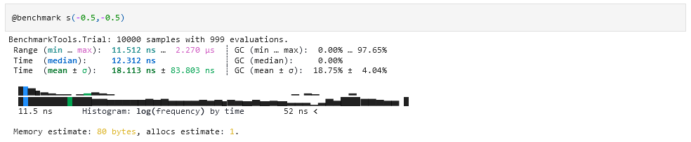
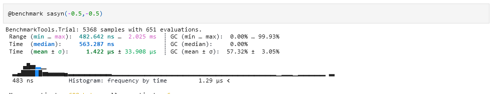
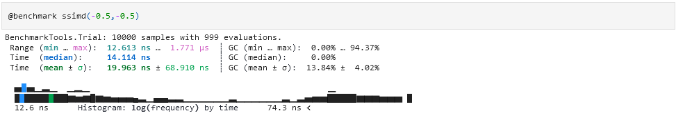
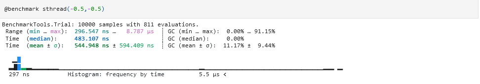

#  Executive Report : Struct

###  Andrea Iskander Belkhir id : 511089

###  Beyza Özdemir id : 576145

###  GitHub url : <a href="https://github.com/andreaIskanderBelkhir/Struct.jl" target="_top">https://github.com/andreaIskanderBelkhir/Struct.jl</a>


# Goal
What we did for this part of the project was the studies of tasks and an approach to the paradigms of paralelization.
 What we used to better understand those concept where the concepts explained in classes and the help of the recommended book **Julia High Performance** mainly the chapters 8,9 and 10.


# Task

Since the base code hadn't any suggestion on what funcion where to apply some sorte of paralelization, we spent the first part on finding what funcions were  candidate to be paralelized.
What we choose were the funcion:

\begin{list}{*}{}

\item S and T funcion.

\item Embededtraversal.

\item Traversal.

\item Struct2lar.

\end{list}

## Choosing the task

What we used as task in the funcions listed before were what was inside the for loop,this because every loop cicle works independently and thats a great indicator for a task.
We can see easly in the code below where the task is a assign
```julia

function  s(args...)
  d  =  length(args)
  mat  =  MMatrix{d+1,d+1,Float64}(1I)
  #create a task an run it asynchronously
  #on the thread
   @async for  k  in  range(1,  length=d)
				 mat[k,k]=args[k]
			end
  return  mat
end
```
# Concurrent or Paralelism

When we worked on the tasks we used both concurrent paradigm with the ```@async``` annotation and paralelism with the annotations ```@simd``` and ```Threads.@spawn``` and we tested with the package Benchmarktools to find the best performance.

## Testing

When we tested the funcions we saw improvmenton on three funcions but with the funcion <s(arg..)> and <t(arg..)> the paradigms returned worse performance compared to the ```@inbounds```. What we understand with the test of those two funcions is that not all funcion (mostly small funcions) need a paralelism approach.







