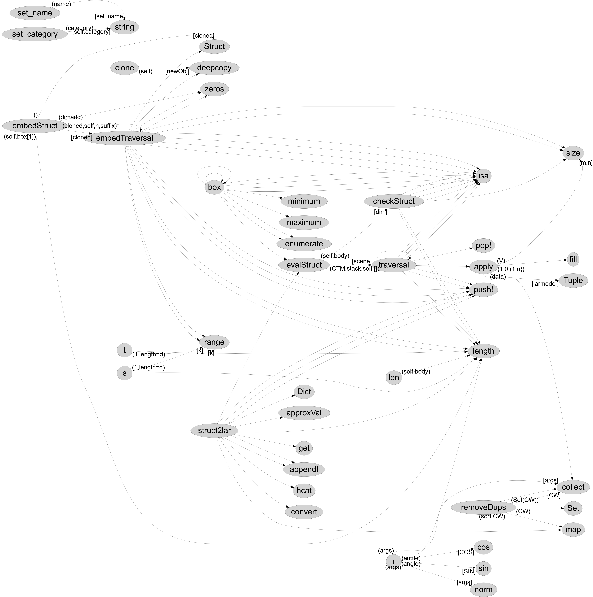

# Initial Report : Struct
### Andrea Iskander Belkhir id : 511089
### Beyza Özdemir id : 576145
### GitHub url : <a href="https://github.com/andreaIskanderBelkhir/Struct.jl" target="_top">https://github.com/andreaIskanderBelkhir/Struct.jl</a>
## Introduction
struct is part of the julia library "LAR.jl".this library perform geometric calculations on cellular complexes expressed through the Linear Algebraic Representation (LAR).
Struct represent complex object and describe those object in they're coordinate system, in this way we can specify the edges.
In the code Struct is used as a acyclic oriented graphs;
an acyclic oriented graphs are a hierarchical structures formed by different component, and every component have they're different coordinate system


## Main interface

A user wanting to use this packege will make use of the 4 main interface :
\begin{list}{*}{}
\item Lar.Struct.
\item Lar.Apply.
\item Lar.Struct2lar.
\item Lar.EvalStruct.
\end{list}


The funcion Struct will create a object of type struct using as input an array of object.
This funcion create a structure of geometrical object starting from an array of object.The attribute of a structure are <body,box,name,dim,category>. this funcion return a "Struct" type value and his coordinate system is based on the first object of the "struct" arguments.Also,
the resulting geometrical value is often associated with a variable name.Every object in struct can be trasformed by a tensor within its own container
The generation of containers may continue hierarchically by suitably applying `Struct`.
this funcion is implemented with 4 methods.

The funcion apply use the larmodel in input with the affinateMatrix to return the larmodel as a tuple formed by points an array of cells.

The funcion struct2lar return the struct given by input as his lar representation.

The funcion evalStruct return the world coordinate of the struct in input

## Example
To help with the project we used 3 example taken from the **[LinearAlgebraicRepresentation.jl](https://github.com/cvdlab/LinearAlgebraicRepresentation.jl)** package. the examples were chosen to have different complexity . Its possible to find the chosen example in the folder /docs/examples.Those example are used to test the entirety of the package,meanwhile for testing the singolar funcion we created some easyer example in the notebook of the specific funcion

## Start
Before starting to improve the code, the work started with understanding the package struct as a whole, right after we started to study the funcions that compose struct.jl dividing each funcion in a notebook and for each create some example to run the code and test it with the annotation @btime, @benchmark and @code_llvm (the last two annotation are not used in notebook with longer funcion for funcionability problem.
Before starting to optimaze the code, we decide thats better to improve the readabilty of the code using new funcion when possible for example the funcion <r(args...)> can use 2 more funcion one for  2D rotation and another for the 3D.

```julia
function r(args...)
 n = length(args)
 if n == 1 # rotation in 2D
	mat=r2D(args)
 end

 if n == 3 # rotation in 3D
	mat=r3D(args)
 end
 return mat
end

```
<div style="page-break-after: always;"></div>


{ width=115% }

